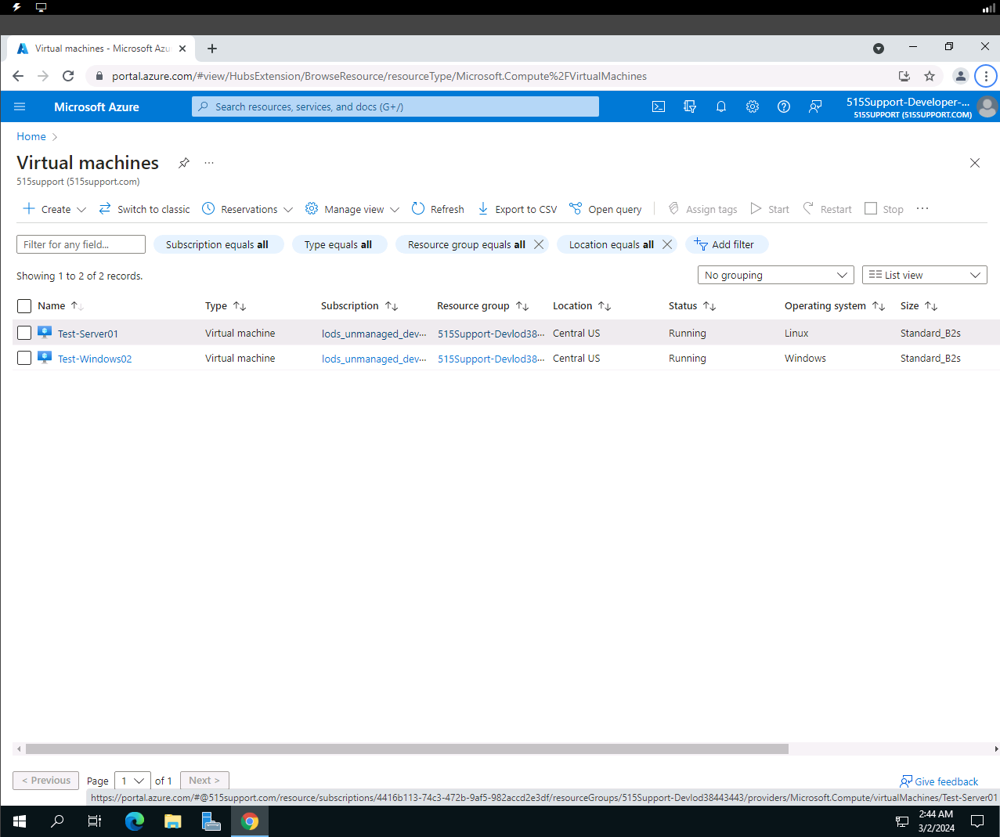
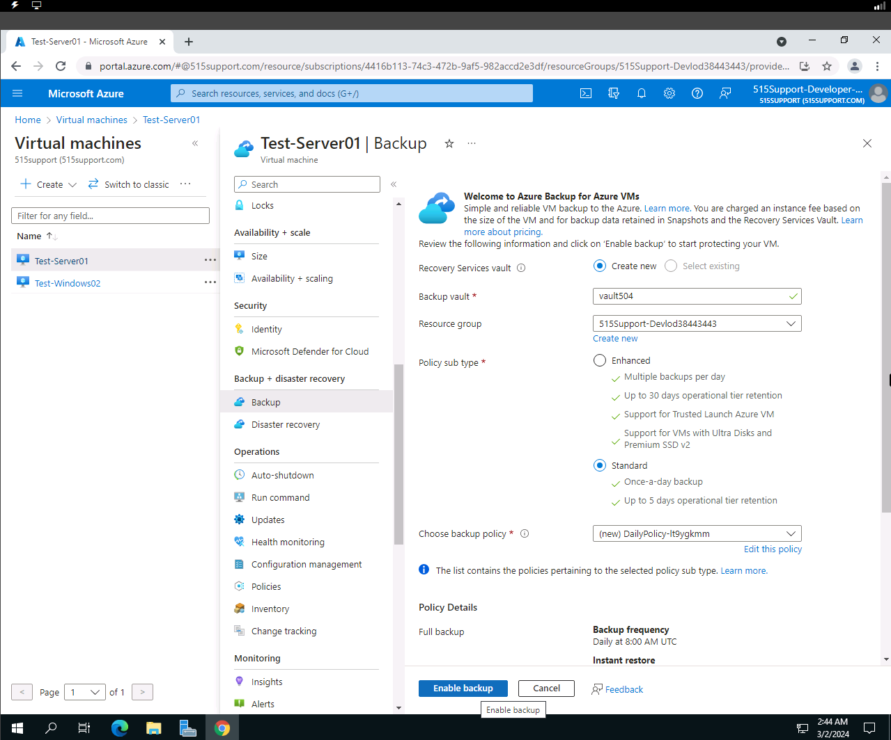
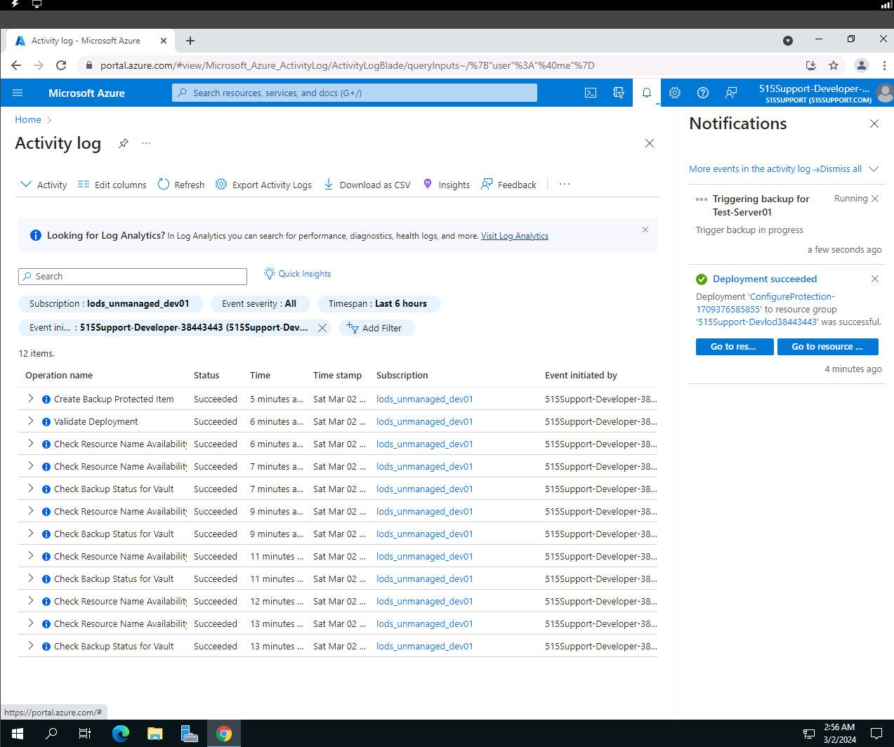
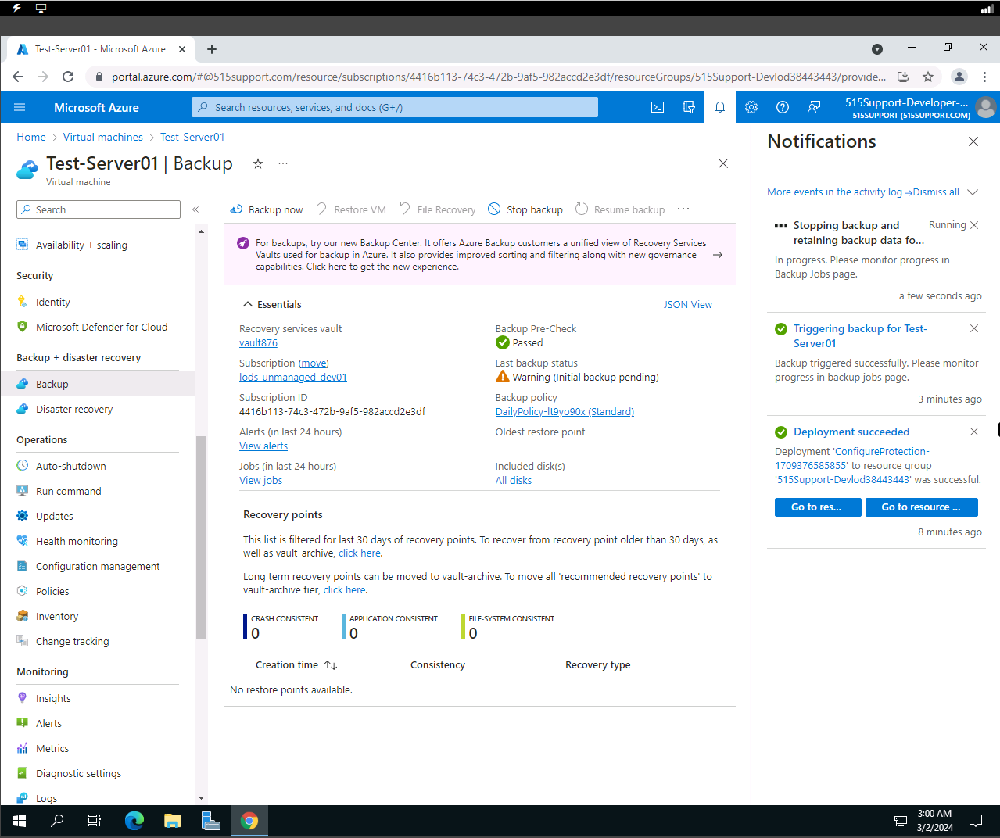
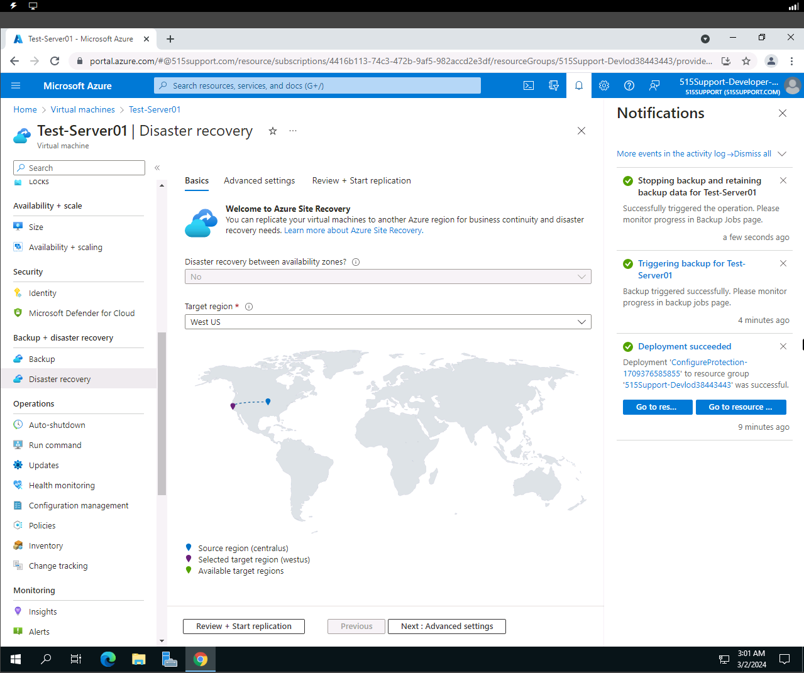
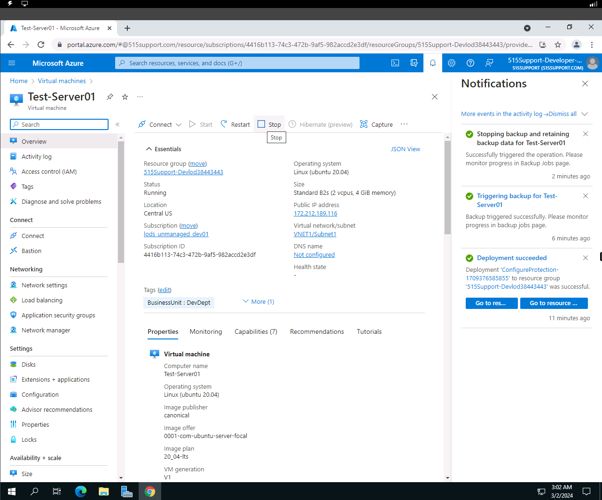
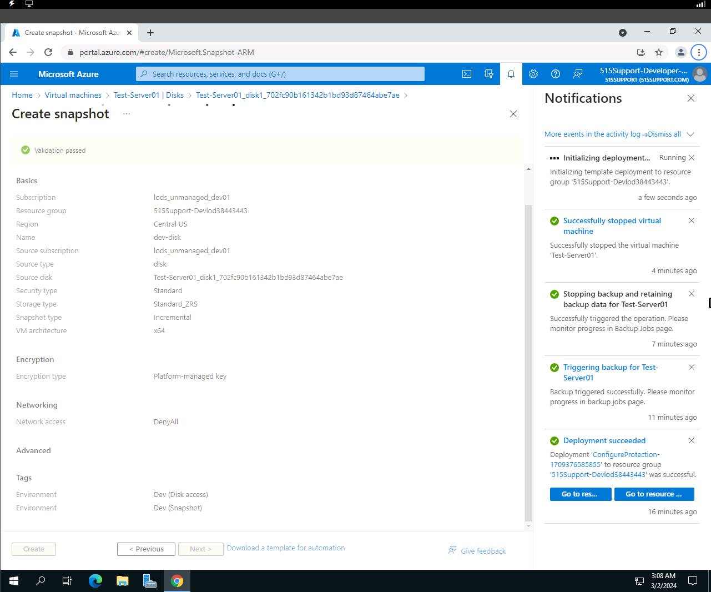
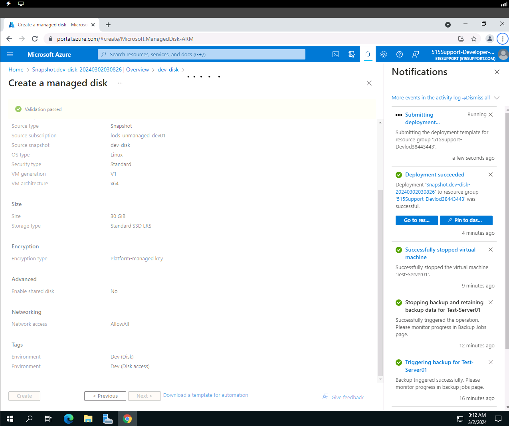
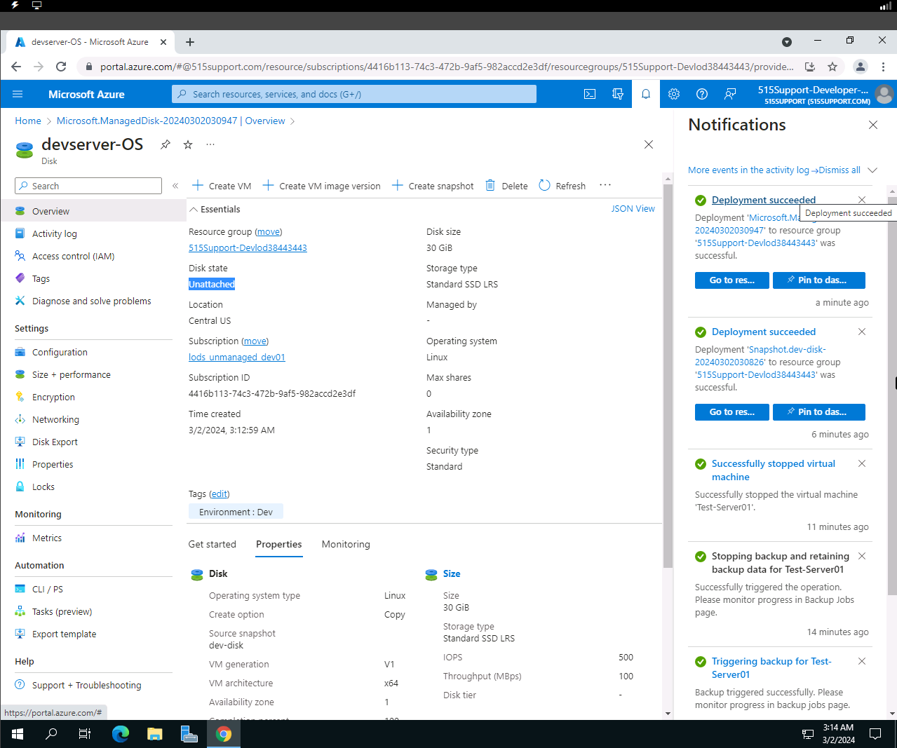

# azdrcap 📼
backup & replication

## Objective
To perform Disaster Recovery task such as backup and replication (disk/storage snapshots).
To ensure business continuity in case of failures or disruptions.

## Azure Cloud DR capabilities 

